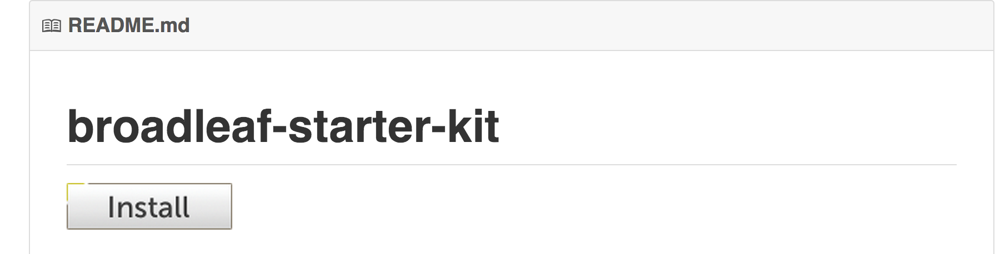
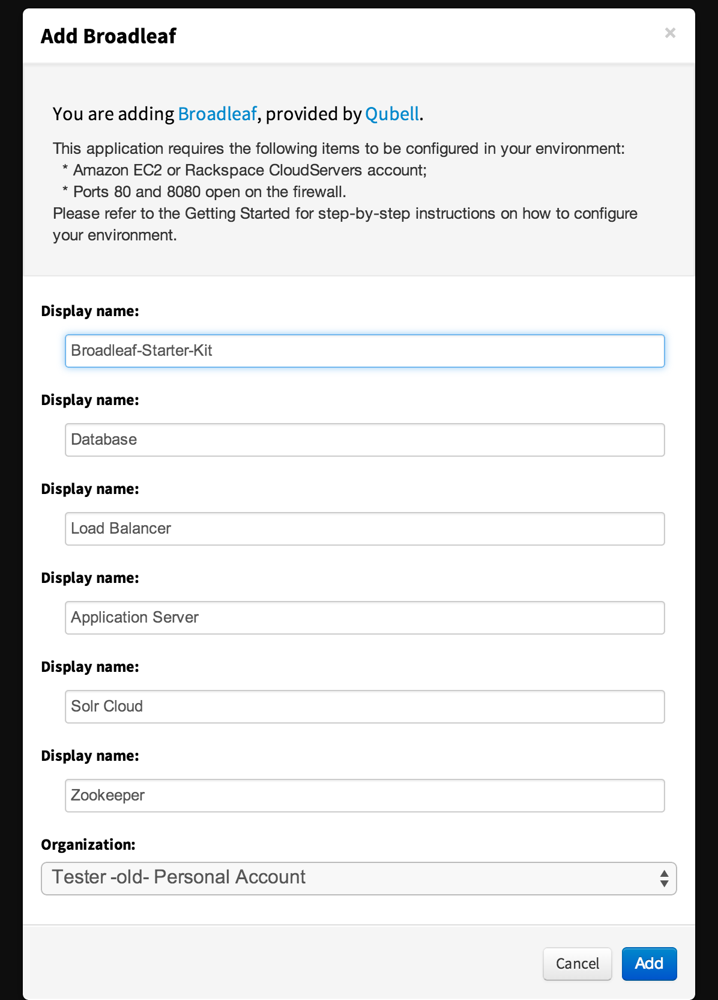
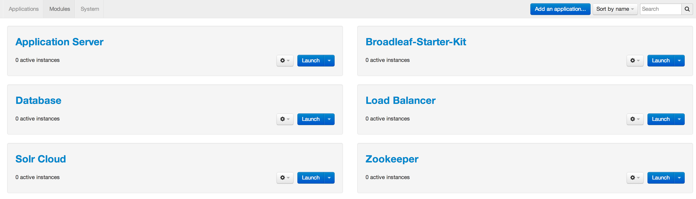

#### Previous Step: [Set up a Qubell Account](step-2-qubell-setup-guide.md)

Step 3. Get the Broadleaf Starter Kit
===========================

To obtain the Broadleaf Starter Kit,navigate to [https://github.com/qubell-bazaar/broadleaf-starter-kit/](https://github.com/qubell-bazaar/broadleaf-starter-kit/) and select the **INSTALL** button.

You will be prompted to confirm the installation within Qubell. Click the **Add** button to continue.

To confirm the installation, navigate to **Applications > Modules**.

#### Next step: [Launch the Application](step-4-launch-guide.md)
